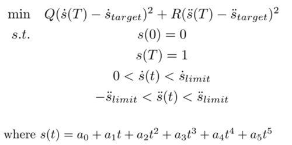
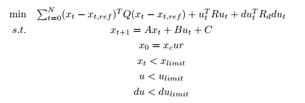
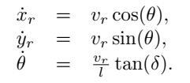

# Readme

This repository constructs a rule-based framework for autonomous driving, including:
* path planning based on spline and Bezier curve
* velocity profile based on quintic polynomial optimization
* linear MPC and PID controller
* IDM following model and Mobile lane-changing model
***
## Requirement
* [Carla-0.9.12](https://carla.org/2021/08/02/release-0.9.12/)

***
## Run
1. run *./CarlaUE4.sh*
2. run *main_single_agent.py* or *multi_agent_agents.py*

***
## Framework

1. **Environment Configuration**:
   * *world_single_agent.py*: Only ego car is controlled by the algorithm, and zombie cars are controlled by autopilot of carla.
   * *world_multi_agents.py*: All the car are controlled by the algorithm. 
2. **Perception**:
   * *feature.py* extracts information from perception, including waypoints, lane points, traffic light, surrounding cars.

3. **Trajectory Planning**:
   * *path_planner.py* plan the path based on extracted waypoints
     * *bezier_curve.py* used in lane changing task
     * *cubic_spline.py* used in following task
   * *velocity_planner.py* formulates a quadratic program problem to optimize the quintic polynomial  
     
 

4. **Control**:
   * *pid.py*: Throttle is calculated based on pid controller for velocity error, and steering is calculated based on pid controller for yaw and track error. 
   * *linear_mpc.py*: The formulation of MPC is as follows:  
     
 
 

     where $x_t=(p_{t,x},p_{t,y},v_t,\phi_t)$ , $u_t=(a_t, \theta_t)$, $du_t=u_t-u_t$. And $x_{ref}$ is obtained from path and velocity planner.  $Q,R$ are the weights of MPC objective. The dynamic model is bicycle model that is defined in *vehicle_model.py*: 
   
 
  
     

5. **Rule-based decision**:
    * *rule_decision.py*: please note the defined status for vehicles to complish follwing, lane changing and stopping tasks. The details of IDM and Mobile model can be seen in websites listed in reference.

***
## Reference
1. [PythonRobotics](https://github.com/AtsushiSakai/PythonRobotics)
2. [Intelligent-Driver Model](https://traffic-simulation.de/info/info_IDM.html)
3. [Lane-change Model MOBIL](https://traffic-simulation.de/info/info_MOBIL.html)